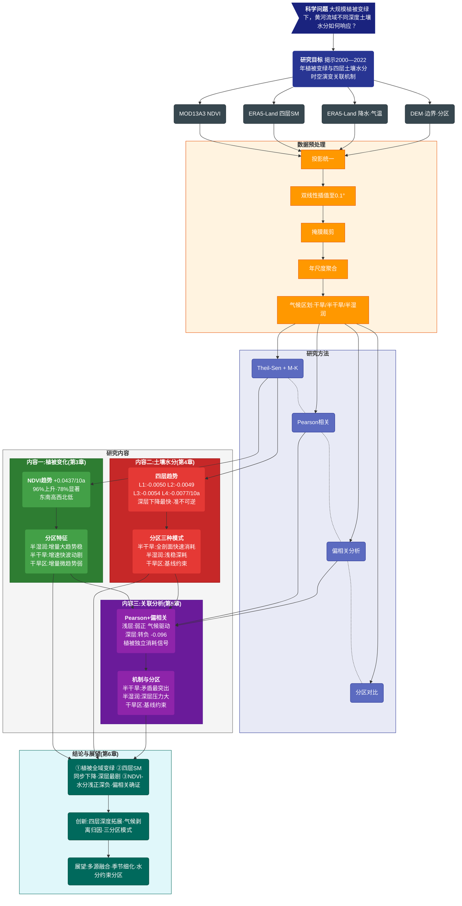

# 大规模植被变绿下黄河流域土壤水分时空演变特征研究 —— 技术路线图



---

## 研究逻辑主线（文本版）

```
科学问题 ──→ 研究目标 ──→ MODIS NDVI + ERA5-Land四层SM + 降水气温 + DEM/分区
                                      │
                    ┌─────────────────┼─────────────────┐
                    ↓                 ↓                 ↓
              投影统一 ──→ 双线性插值0.1° ──→ 掩膜裁剪 ──→ 年聚合 ──→ 气候区划
                                      │
              Theil-Sen+M-K ◄────┬───┘    Pearson+偏相关 ◄─── 分区对比
                    │            │            │                  │
                    ↓            │            ↓                  │
         ┌──────────────────┐    │   ┌──────────────────┐       │
         │ 内容一:植被变化    │    │   │ 内容三:关联分析    │       │
         │ NDVI +0.0437/10a │────┼──→│ 浅正深负·偏相关   │←──────┘
         │ 96%↑·78%显著     │    │   │ 深层-0.096       │
         └────────┬─────────┘    │   └────────┬─────────┘
                  │              │            │
         ┌────────┴─────────┐    │            │
         │ 内容二:土壤水分    │    │            │
         │ 四层全降·深层最快  │────┘            │
         │ 三种分区响应模式   │                 │
         └────────┬─────────┘                 │
                  └───────────────────────────┘
                                      ↓
                    结论:植被全域变绿·深层准不可逆消耗·浅正深负
                    创新:四层深度拓展·气候剥离归因·三分区模式
```

---

## 关键数据速查

| 指标 | 数值 | 含义 |
|:-----|:-----|:-----|
| NDVI趋势 | **+0.0437/10a**, 78%显著↑ | 全域性变绿 |
| swvl1~3趋势 | -0.0049~-0.0054/10a | 浅中层缓降 |
| swvl4趋势 | **-0.0077/10a** | 深层下降最快 |
| 浅层Pearson r | +0.072~0.091 | 气候驱动弱正 |
| 深层Pearson r | **-0.089** | 转为负相关 |
| 深层偏相关 r | **-0.096** | 植被净消耗确证 |
| 半干旱swvl2 | **-0.0099/10a** | 全表最大降速 |
| 半湿润swvl4 | -0.0084/10a | 深层加速消耗 |
