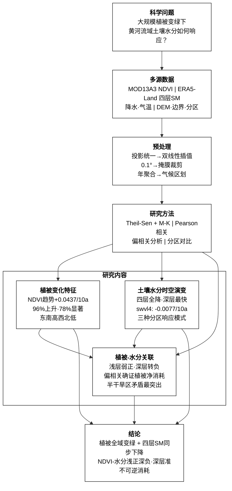

# 大规模植被变绿下黄河流域土壤水分时空演变特征研究 —— 技术路线图

```mermaid
flowchart TD
    A["<b>科学问题</b><br/>大规模植被变绿下<br/>黄河流域土壤水分如何响应？"]

    B["<b>多源数据</b><br/>MOD13A3 NDVI | ERA5-Land 四层SM<br/>降水·气温 | DEM·边界·分区"]

    C["<b>预处理</b><br/>投影统一→双线性插值0.1°→掩膜裁剪<br/>年聚合→气候区划"]

    D["<b>研究方法</b><br/>Theil-Sen + M-K | Pearson相关<br/>偏相关分析 | 分区对比"]

    subgraph E["<b>研究内容</b>"]
        direction LR
        E1["<b>植被变化特征</b><br/>NDVI趋势+0.0437/10a<br/>96%上升·78%显著<br/>东南高西北低"]
        E2["<b>土壤水分时空演变</b><br/>四层全降·深层最快<br/>swvl4: -0.0077/10a<br/>三种分区响应模式"]
        E3["<b>植被-水分关联</b><br/>浅层弱正·深层转负<br/>偏相关确证植被净消耗<br/>半干旱区矛盾最突出"]
    end

    F["<b>结论</b><br/>植被全域变绿 + 四层SM同步下降<br/>NDVI-水分浅正深负·深层准不可逆消耗"]

    A --> B --> C --> D --> E1 & E2 & E3

    E1 --> E3
    E2 --> E3

    E1 & E2 & E3 --> F

    style A fill:#fff,stroke:#000,color:#000
    style B fill:#fff,stroke:#000,color:#000
    style C fill:#fff,stroke:#000,color:#000
    style D fill:#fff,stroke:#000,color:#000
    style E fill:#fff,stroke:#000,color:#000
    style E1 fill:#fff,stroke:#000,color:#000
    style E2 fill:#fff,stroke:#000,color:#000
    style E3 fill:#fff,stroke:#000,color:#000
    style F fill:#fff,stroke:#000,color:#000
```
