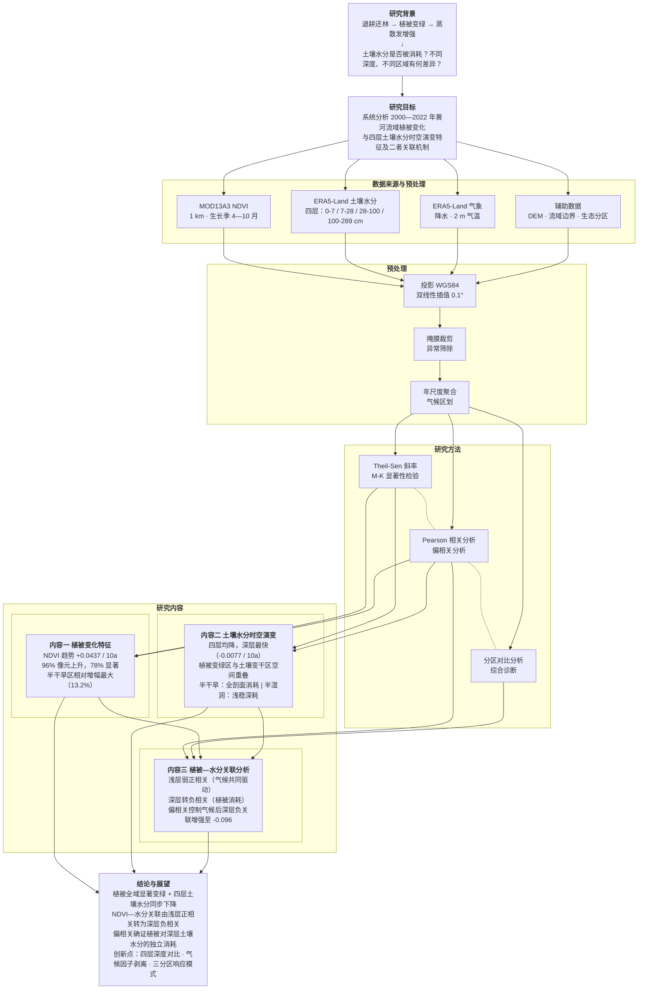

# 大规模植被变绿下黄河流域土壤水分时空演变特征研究 —— 技术路线图

```mermaid
flowchart TD
    P1["<b>研究背景</b>
退耕还林 → 植被变绿 → 蒸散发增强
↓
土壤水分是否被消耗？不同深度、不同区域有何差异？"]

    P2["<b>研究目标</b>
系统分析 2000—2022 年黄河流域植被变化
与四层土壤水分时空演变特征及二者关联机制"]

    P1 --> P2

    subgraph P3["<b>数据来源与预处理</b>"]
        direction LR
        D1["MOD13A3 NDVI
1 km · 生长季 4—10 月"]
        D2["ERA5-Land 土壤水分
四层：0-7 / 7-28 / 28-100 / 100-289 cm"]
        D3["ERA5-Land 气象
降水 · 2 m 气温"]
        D4["辅助数据
DEM · 流域边界 · 生态分区"]
    end

    P2 --> D1 & D2 & D3 & D4

    subgraph P4["<b>预处理</b>"]
        direction LR
        S1["投影 WGS84
双线性插值 0.1°"] --> S2["掩膜裁剪
异常筛除"] --> S3["年尺度聚合
气候区划"]
    end

    D1 & D2 & D3 & D4 --> S1

    subgraph P5["<b>研究方法</b>"]
        direction LR
        M1["Theil-Sen 斜率
M-K 显著性检验"] -..- M2["Pearson 相关分析
偏相关分析"] -..- M3["分区对比分析
综合诊断"]
    end

    S3 --> M1 & M2 & M3

    subgraph P6["<b>研究内容</b>"]
        direction LR
        subgraph C1[" "]
            C1a["<b>内容一 植被变化特征</b>
NDVI 趋势 +0.0437 / 10a
96% 像元上升，78% 显著
半干旱区相对增幅最大（13.2%）"]
        end
        subgraph C2[" "]
            C2a["<b>内容二 土壤水分时空演变</b>
四层均降，深层最快（-0.0077 / 10a）
植被变绿区与土壤变干区空间重叠
半干旱：全剖面消耗 | 半湿润：浅稳深耗"]
        end
        subgraph C3[" "]
            C3a["<b>内容三 植被—水分关联分析</b>
浅层弱正相关（气候共同驱动）
深层转负相关（植被消耗）
偏相关控制气候后深层负关联增强至 -0.096"]
        end
    end

    M1 & M2 --> C1a
    M1 & M2 --> C2a
    M2 & M3 --> C3a
    C1a --> C3a
    C2a --> C3a

    C1a & C2a & C3a --> P7["<b>结论与展望</b>
植被全域显著变绿 + 四层土壤水分同步下降
NDVI—水分关联由浅层正相关转为深层负相关
偏相关确证植被对深层土壤水分的独立消耗
创新点：四层深度对比 · 气候因子剥离 · 三分区响应模式"]
```
