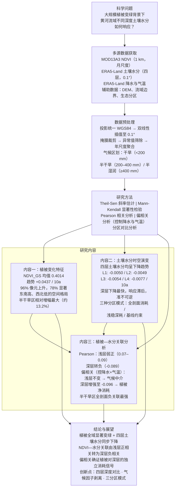

# 大规模植被变绿下黄河流域土壤水分时空演变特征研究 —— 技术路线图

```mermaid
flowchart TD
    A["科学问题
大规模植被变绿背景下
黄河流域不同深度土壤水分如何响应？"]

    B["多源数据获取
MOD13A3 NDVI（1 km，月尺度）
ERA5-Land 土壤水分（四层，0.1°）
ERA5-Land 降水与气温
辅助数据：DEM、流域边界、生态分区"]

    C["数据预处理
投影统一 WGS84 → 双线性插值至 0.1°
掩膜裁剪 → 异常值筛除 → 年尺度聚合
气候区划：干旱（<200 mm）
半干旱（200–400 mm）/ 半湿润（≥400 mm）"]

    D["研究方法
Theil-Sen 斜率估计 | Mann-Kendall 显著性检验
Pearson 相关分析 | 偏相关分析（控制降水与气温）
分区对比分析"]

    subgraph E["研究内容"]
        direction LR
        E1["内容一：植被变化特征
NDVI_GS 均值 0.4014
趋势 +0.0437 / 10a
96% 像元上升，78% 显著
东南高、西北低的空间格局
半干旱区相对增幅最大（约 13.2%）"]
        E2["内容二：土壤水分时空演变
四层土壤水分均呈下降趋势
L1: -0.0050 / L2: -0.0049
L3: -0.0054 / L4: -0.0077 / 10a
深层下降最快，响应滞后，准不可逆
三种分区模式：全剖面消耗 /
浅稳深耗 / 基线约束"]
        E3["内容三：植被—水分关联分析
Pearson：浅层弱正（0.07–0.09）
深层转负（-0.089）
偏相关（控降水+气温）：
浅层不变 → 气候中介
深层增强至 -0.096 → 植被净消耗
半干旱区全剖面负关联最强"]
    end

    F["结论与展望
植被全域显著变绿 + 四层土壤水分同步下降
NDVI—水分关联由浅层正相关转为深层负相关
偏相关确证植被对深层的独立消耗信号
创新点：四层深度对比 · 气候因子剥离 · 三分区模式"]

    A --> B --> C --> D
    D --> E1
    D --> E2
    D --> E3
    E1 --> E3
    E2 --> E3
    E1 & E2 & E3 --> F
```
