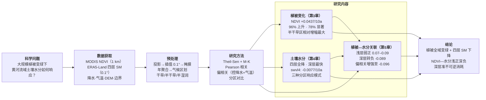

# 大规模植被变绿下黄河流域土壤水分时空演变特征研究 —— 技术路线图

```mermaid
flowchart LR
    A["<b>科学问题</b>
大规模植被变绿下
黄河流域土壤水分如何响应？"]

    B["<b>数据获取</b>
MODIS NDVI（1 km）
ERA5-Land 四层 SM（0.1°）
降水·气温·DEM·边界"]

    C["<b>预处理</b>
投影→插值 0.1°→掩膜
年聚合→气候区划
干旱/半干旱/半湿润"]

    D["<b>研究方法</b>
Theil-Sen + M-K
Pearson 相关
偏相关（控降水+气温）
分区对比"]

    subgraph E["<b>研究内容</b>"]
        direction TB
        E1["<b>植被变化（第3章）</b>
NDVI +0.0437/10a
96% 上升 · 78% 显著
半干旱区相对增幅最大"]
        E2["<b>土壤水分（第4章）</b>
四层全降 · 深层最快
swvl4: -0.0077/10a
三种分区响应模式"]
        E3["<b>植被—水分关联（第5章）</b>
浅层弱正 0.07–0.09
深层转负 -0.089
偏相关增强至 -0.096"]
    end

    F["<b>结论</b>
植被全域变绿 + 四层 SM 下降
NDVI—水分浅正深负
深层准不可逆消耗"]

    A --> B --> C --> D --> E1
    D --> E2
    D --> E3
    E1 --> E3
    E2 --> E3
    E1 & E2 & E3 --> F
```
