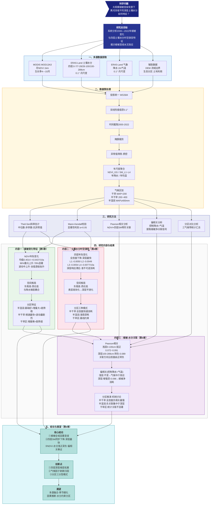

# 大规模植被变绿下黄河流域土壤水分时空演变特征研究 —— 技术路线图



---

## 研究逻辑主线（文本版，确保跨平台可读）

```
                        ┌─────────────────────────────────┐
                        │  科学问题：大规模植被变绿下       │
                        │  黄河流域土壤水分如何响应？       │
                        └───────────────┬─────────────────┘
                                        ↓
                        ┌─────────────────────────────────┐
                        │  研究目标：系统揭示植被变绿与     │
                        │  四层土壤水分的时空关联机制       │
                        └───────────────┬─────────────────┘
                                        ↓
        ┌───────────────────────────────┼───────────────────────────────┐
        ↓                               ↓                               ↓
┌───────────────┐             ┌─────────────────┐             ┌───────────────┐
│   MOD13A3     │             │  ERA5-Land      │             │  辅助数据     │
│   NDVI 1km    │             │  四层SM 0.1°    │             │  DEM·边界     │
│   月尺度       │             │  降水·气温       │             │  生态分区     │
└───────┬───────┘             └───────┬─────────┘             └───────┬───────┘
        └───────────────────────────────┼───────────────────────────────┘
                                        ↓
        ┌───────────────────────────────────────────────────────────────┐
        │  预处理：投影统一→双线性插值0.1°→掩膜裁剪→异常筛除→年聚合     │
        │  气候区划：干旱区(MAP<200) | 半干旱区(200-400) | 半湿润区(≥400) │
        └───────────────────────────────┬───────────────────────────────┘
                                        ↓
        ┌───────────────────────────────┼───────────────────────────────┐
        │              研究方法                                          │
        │  Theil-Sen · M-K检验 · Pearson相关 · 偏相关 · 分区对比        │
        └───────────────────────────────┬───────────────────────────────┘
                                        ↓
    ┌───────────────────────────────────┼───────────────────────────────────┐
    ↓                                   ↓                                   ↓
┌───────────┐                   ┌───────────┐                   ┌───────────┐
│ 内容一     │                   │ 内容二     │                   │ 内容三     │
│ 植被变化   │  ──── 驱动 ────→  │ 土壤水分   │  ←── 响应 ────  │ 植被-水分  │
│ (第3章)   │                   │ (第4章)   │                   │ 关联(第5章)│
├───────────┤                   ├───────────┤                   ├───────────┤
│·NDVI年际  │                   │·四层年际   │                   │·Pearson   │
│ 均值0.4014│                   │ 全剖面下降 │                   │ 浅正深负   │
│ +0.0437/a │                   │ 深层最快   │                   │·偏相关     │
│·96%上升   │                   │·三种分区   │                   │ 深层-0.096│
│ 78%显著   │                   │ 响应模式   │                   │ 植被净消耗 │
│·东南高    │                   │·深层滞后   │                   │·分区推演   │
│ 西北低    │                   │ 准不可逆   │                   │ 半干旱最强 │
└─────┬─────┘                   └─────┬─────┘                   └─────┬─────┘
      └───────────────────────────────┼───────────────────────────────┘
                                      ↓
                      ┌─────────────────────────────┐
                      │  结论与展望 （第6章）         │
                      ├─────────────────────────────┤
                      │  核心发现：                  │
                      │  ① 植被全域显著变绿          │
                      │  ② 四层SM同步下降·深层最剧   │
                      │  ③ 浅正深负·偏相关确证      │
                      │                             │
                      │  创新点：                    │
                      │  ① 四层深度维度拓展          │
                      │  ② 气候因子剥离归因          │
                      │  ③ 三分区响应模式            │
                      └─────────────────────────────┘
```

---

## 关键数据速查

| 指标 | 数值 | 方向 |
|:-----|:-----|:-----|
| NDVI多年均值 | 0.4014 | — |
| NDVI线性趋势 | **+0.0437/10a** | ↑ 显著上升 |
| NDVI显著上升面积 | **78.00%** | ↑ 全域变绿 |
| swvl1 (0-7cm) 趋势 | -0.0050/10a | ↓ |
| swvl2 (7-28cm) 趋势 | -0.0049/10a | ↓ |
| swvl3 (28-100cm) 趋势 | -0.0054/10a | ↓ |
| swvl4 (100-289cm) 趋势 | **-0.0077/10a** | ↓↓ 下降最快 |
| 浅层Pearson r | +0.072 ~ +0.091 | 弱正相关 |
| 深层Pearson r | **-0.089** | 转为负相关 |
| 深层偏相关 r | **-0.096** | 负关联更强 |
| 半干旱区 swvl2 趋势 | **-0.0099/10a** | 全表最大降速 |
| 半湿润区 swvl4 趋势 | -0.0084/10a | 深层快速消耗 |
