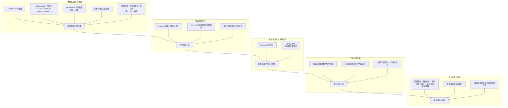

```mermaid
flowchart TD
    %% 设置全局方向和字体
    %% 从左到右布局，便于单页展示
    %% 采用缩短文字与分组方法压缩页幅
    %% 主流程
    direction LR

    A[数据获取与预处理] --> B[时空趋势分析]
    B --> C[植被-土壤水分关联分析]
    C --> D[分区比较分析]
    D --> E[综合讨论与结论]

    %% 数据获取与预处理
    subgraph 数据获取与预处理
        direction TB
        A1[MODIS NDVI 数据] --> A
        A2[ERA5-Land 土壤水分
0–7cm,7–28cm,28–100cm,100–289cm] --> A
        A3[ERA5-Land 气象数据
降水、温度] --> A
        A4[土地利用与生态分区] --> A
        A5[数据清洗、异常值剔除、重采样
至0.1°×0.1°格网] --> A
    end

    %% 时空趋势分析
    subgraph 时空趋势分析
        direction TB
        B1[Theil-Sen斜率计算年际变化] --> B
        B2[Mann-Kendall检验趋势显著性] --> B
        B3[像元尺度制图与分区统计] --> B
    end

    %% 植被-土壤水分关联分析
    subgraph 植被-土壤水分关联分析
        direction TB
        C1[Pearson相关分析] --> C
        C2[偏相关分析
控制降水和温度] --> C
    end

    %% 分区比较分析
    subgraph 分区比较分析
        direction TB
        D1[按生态功能区和气候带分区] --> D
        D2[比较区域土壤水分响应差异] --> D
        D3[分析自然因素与人为因素作用] --> D
    end

    %% 综合讨论与结论
    subgraph 综合讨论与结论
        direction TB
        E1[逻辑链条：植被变绿 -> 多层土壤水分响应 -> 区域差异 -> 调控策略] --> E
        E2[提炼规律与驱动机制] --> E
        E3[提出生态保护与水资源管理建议] --> E
    end
```
