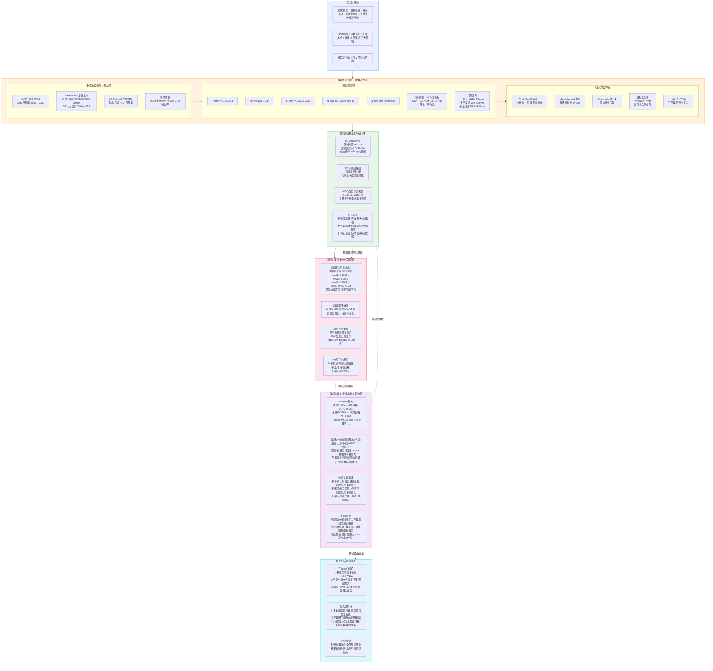

# 大规模植被变绿下黄河流域土壤水分时空演变特征研究 —— 技术路线流程图



---

## 研究逻辑链条总览

```
┌─────────────────────────────────────────────────────────────────────────────┐
│                         研 究 逻 辑 主 线                                    │
├─────────────────────────────────────────────────────────────────────────────┤
│                                                                             │
│  数据层       趋势层         关联层          归因层           决策层        │
│  ───────     ───────       ───────        ───────         ───────        │
│                                                                             │
│  MODIS    →  NDVI趋势    →  Pearson相关  →  偏相关分析   →  分区管理策略   │
│  NDVI        +0.0437/10a    浅层弱正        控制气候因子     半干旱区:审慎  │
│              96%上升        深层转负        深层负增强       半湿润区:监测  │
│  ERA5     →  四层SM趋势  →  NDVI-水分     →  非对称中介    →  深层纳入评估  │
│  -Land       深层最快        关联剖面分异    浅层:气候伪影                   │
│  四层SM      三种区域模式    显著负占比      深层:植被消耗                   │
│              深度分化        沿深度递增      净关联信号                      │
│                                                                             │
│  输入  ────────→  描述  ────────→  关联  ────────→  归因  ────────→  应用  │
│                                                                             │
└─────────────────────────────────────────────────────────────────────────────┘
```

---

## 核心结论速览

| 维度 | 关键数值 | 含义 |
|:---|:---|:---|
| **植被变绿** | NDVI +0.0437/10a, 78%显著上升 | 全域性、趋势性改善 |
| **浅层水分** | swvl1~3 下降 -0.0049~-0.0054/10a | 缓降,受降水缓冲保护 |
| **深层水分** | swvl4 下降 -0.0077/10a, 居四层之首 | 累积性消耗,准不可逆 |
| **浅层关联** | Pearson r = +0.072~0.091 | 气候驱动型弱正相关 |
| **深层关联** | Pearson r = -0.089, 偏相关 r = -0.096 | 植被消耗型负相关 |
| **半干旱区** | NDVI增幅最大 + 全剖面快速消耗 | 速度-压力矛盾最突出 |
| **半湿润区** | 浅稳深耗, swvl4 -0.0084/10a | 深度-压力矛盾最突出 |

---

## 图示说明

- **蓝色** — 第1章：研究背景与目标设定
- **橙色** — 第2章：数据来源、预处理与方法体系
- **绿色** — 第3章：植被NDVI时空变化特征
- **红色** — 第4章：土壤水分四层时空演变
- **紫色** — 第5章：植被-土壤水分关联与归因
- **青色** — 第6章：结论、创新点与展望

> 虚线箭头表示章节间的逻辑递进关系：第3章提供植被变绿的事实基础，第4章提供土壤水分响应变量，两者共同输入第5章进行耦合关系诊断，最终汇聚于第6章的结论与建议。
